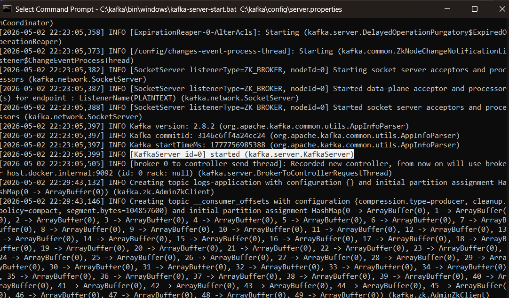
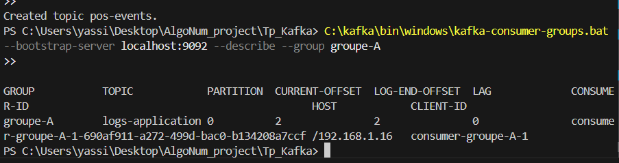
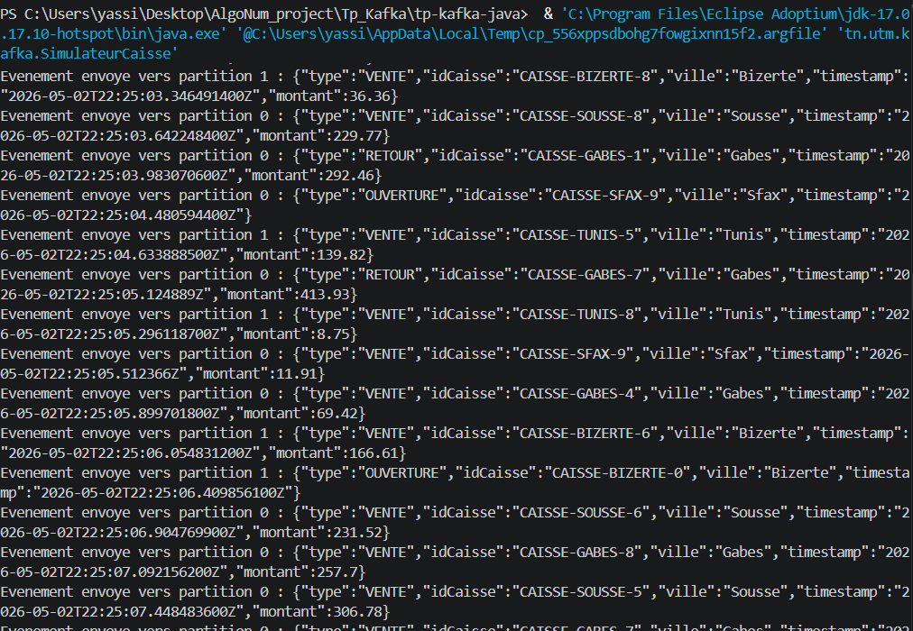
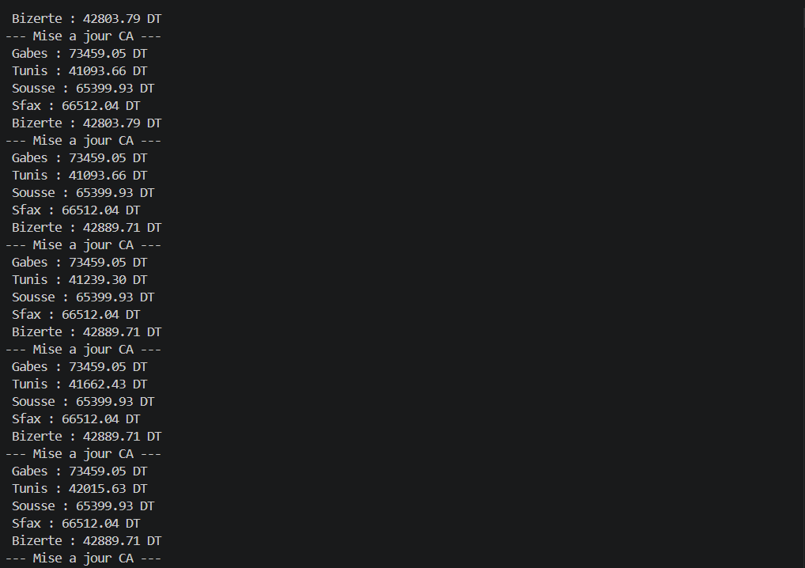
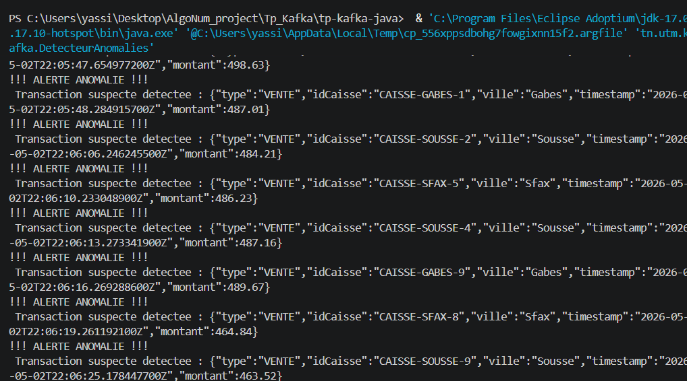

# Compte-rendu de Travaux Pratiques : Apache Kafka
## Architecture, Déploiement et Programmation en Temps Réel

**Étudiant :** Yassine Drira  
**Date :** 2 mai 2026  
**Cours :** Algorithmique Numérique / Systèmes Distribués

---

## 1. Introduction et Objectifs
Ce rapport documente la mise en place d'un environnement Apache Kafka complet sous Windows. L'objectif était de maîtriser le cycle de vie des données, depuis le déploiement de l'infrastructure jusqu'à la création d'un pipeline de traitement de flux (Streaming) en Java, simulant un système de caisses enregistreuses en temps réel.

---

## 2. Infrastructure et Déploiement

### 2.1 Configuration du Broker
Le déploiement a été réalisé sur une instance mono-machine. Initialement prévu en mode **KRaft**, j'ai pris la décision technique de basculer vers le mode **ZooKeeper** (version 2.8.2) pour garantir la stabilité sous Windows, évitant ainsi les conflits de verrouillage de fichiers (`java.nio.file.FileSystemException`) spécifiques à l'implémentation du quorum KRaft sur cet OS.

**Configuration clé :**
- **Broker ID :** `0`
- **Port :** `9092`
- **Répertoire de stockage :** `C:/kafka-logs-zk` (choisi à la racine pour éviter les limitations de longueur de chemin de Windows).

### 2.2 Résolution d'incidents techniques
Lors du démarrage, deux obstacles majeurs ont été surmontés :
1. **Erreur WMIC :** La commande `wmic` étant obsolète sur les versions récentes de Windows 11, le calcul automatique de la mémoire échouait. J'ai résolu cela en définissant manuellement les options de la JVM : `set KAFKA_HEAP_OPTS=-Xmx1G -Xms1G`.
2. **Version du client :** Une désynchronisation entre les librairies Java (3.9.0) et le serveur (2.8.2) causait des erreurs de protocole (`Invalid Receive Size`). L'alignement des versions a rétabli la communication.

> [!NOTE]  
> **Capture n°1 : Démarrage réussi du serveur Kafka**  
> 

---

## 3. Administration via CLI (Command Line Interface)

### 3.1 Gestion des Topics et Partitionnement
Le topic `logs-application` a été créé avec **4 partitions**. L'analyse du comportement a révélé les points suivants :
- **Sans clé :** Kafka utilise un algorithme de type *Round-Robin*, garantissant une répartition équitable de la charge sur les partitions.
- **Avec clé :** En utilisant des clés comme `serveur-1`, `serveur-2`, etc., Kafka assure que tous les messages liés à une même entité arrivent dans la même partition (via un hachage de la clé), garantissant ainsi l'**ordre chronologique** des événements par source.

### 3.2 Parallélisme et Groupes de Consommateurs
Le test avec le groupe `groupe-A` a permis de valider le mécanisme de **Rebalance**.
- Avec un seul consommateur, celui-ci lit les 4 partitions.
- L'ajout d'un second membre déclenche une réassignation automatique (2 partitions chacun).
- **Limitation :** Si l'on ajoute un 5ème consommateur pour un topic de 4 partitions, ce dernier reste en attente (Idle), car une partition ne peut être traitée que par un seul membre d'un même groupe à la fois.

> [!IMPORTANT]  
> **Capture n°2 : État du groupe de consommateurs et offsets**  
> 

---

## 4. Développement Java : Le Pipeline de Données

### 4.1 Modélisation et Sérialisation
Pour le mini-projet, j'ai implémenté une classe `Vente` sérialisée en **JSON** via la bibliothèque **Jackson**. Ce choix permet une flexibilité totale dans l'évolution du schéma de données par rapport à une simple chaîne de caractères.

### 4.2 Architecture du Mini-Projet (Point de Vente)
Le système repose sur trois composants travaillant de concert :

1. **Simulateur de Caisse (`SimulateurCaisse.java`)** : 
   - Produit des événements aléatoires (Ventes, Retours, Ouvertures).
   - Utilise l'**Idempotence** et les **ACKS=all** pour garantir qu'aucune transaction n'est perdue ou dupliquée.
   - **Capture d'écran :**  
     

2. **Analyseur de Revenus (`ChiffreAffairesParVille.java`)** : 
   - Consomme le flux en temps réel.
   - Agrège les montants par ville dans une structure de données dynamique.
   - **Capture d'écran :**  
     

3. **Détecteur d'Anomalies (`DetecteurAnomalies.java`)** : 
   - Filtre les transactions suspectes (ex: montant > 450 DT).
   - Envoie des alertes immédiates sur la console d'administration.
   - **Capture d'écran :**  
     

---

## 5. Conclusion
Ce travail pratique a permis de démontrer la puissance de Kafka comme colonne vertébrale d'un système distribué. Au-delà des manipulations techniques, la gestion des offsets manuels et le partitionnement par clé sont les deux concepts fondamentaux retenus pour garantir la cohérence et la scalabilité d'une application de streaming de données réelle.

---
*Document généré pour le rendu final du TP Kafka.*
